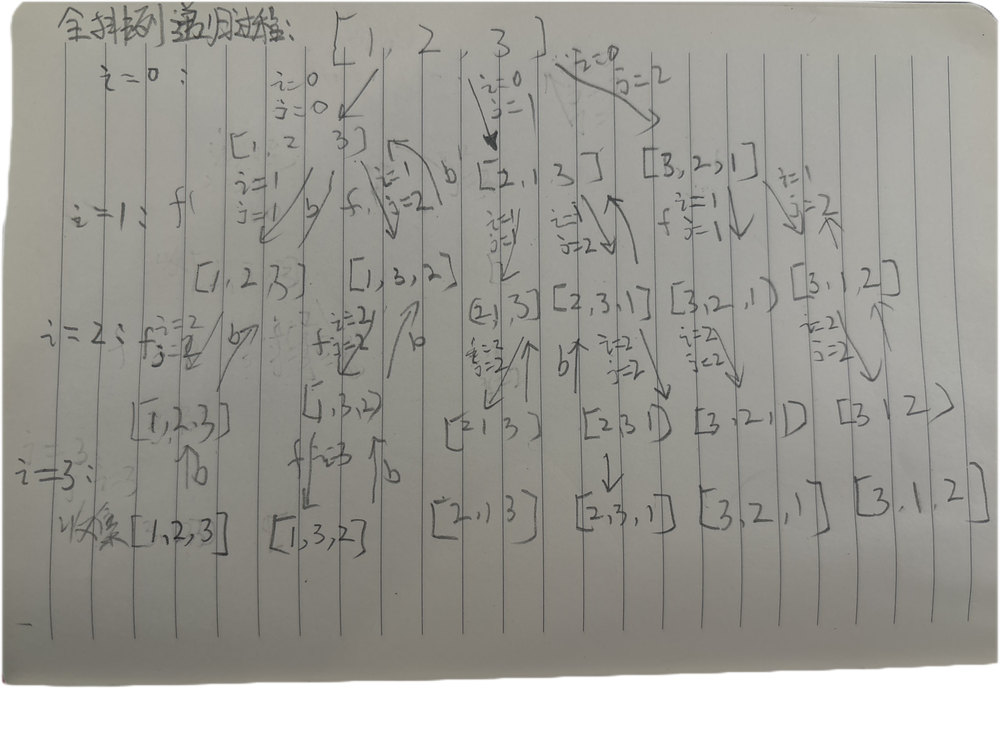

# 常见经典递归过程解析

带路径的递归 vs 不带路径的递归(大部分dp，状态压缩dp认为是路径简化了结构，dp专题后续讲述)

任何递归都是dfs且非常灵活。回溯这个术语并不重要

# 题目1 : 返回字符串全部子序列，子序列要求去重。

时间复杂度O(2^n * n)

比如：字符串："abc"，整体递归过程如下：

1. 要a，要b，要c，：abc
2. 要a，要b，不要c，：ab
3. 要a，不要b，要c ：ac
4. 不要a，要b，要c：bc
5. 不要a，要b，不要c：ab
6. 不要a，不要b，要c：ac
7. 不要a，不要b，不要c：空

**主意：**什么时候收集答案？当每次**决策idx来到数组arr的位置**时，收集答案。

```java
// 方法1:使用StringBuilder来构建整体的path
public static String[] generatePermutation1(String str) {
    char[] array = str.toCharArray();
    Set<String> set = new HashSet<>();
    f(array, 0, new StringBuilder(), set);
    String[] ans = new String[set.size()];
    int idx = 0;
    for (String s : set) {
        ans[idx++] = s;
    }
    return ans;
}

// s[i...]，之前决定的路径path，set收集结果时去重
private static void f(char[] array, int idx, StringBuilder path, Set<String> set) {
    if (idx == array.length) {
        set.add(path.toString());
    } else {
        path.append(array[idx]); // 加入当前字符，然后递归去下一个位置吧
        f(array, idx + 1, path, set);
        path.deleteCharAt(path.length() - 1);  // 不要当前字符，然后递归去下一个位置吧
        f(array, idx + 1, path, set);
    }
}
```


```java
// 解法2: 使用数组结构代替SB
public static String[] generatePermutation2(String str) {
    char[] s = str.toCharArray();
    HashSet<String> set = new HashSet<>();
    f2(s, 0, new char[s.length], 0, set);
    int m = set.size();
    String[] ans = new String[m];
    int i = 0;
    for (String cur : set) {
        ans[i++] = cur;
    }
    return ans;
}

private static void f2(char[] s, int i, char[] path, int size, HashSet<String> set) {
    if (i == s.length) {
        set.add(String.valueOf(path, 0, size)); // 收集答案，0～size 的字符
    } else {
        path[size] = s[i];
        f2(s, i + 1, path, size + 1, set); // size + 1 要当前位置数据
        f2(s, i + 1, path, size, set);          // size 不动 不要当前位置的数据
    }
}
```

# 题目2 : 返回数组的所有组合，可以无视元素顺序。

时间复杂度O(2^n * n)

给你一个整数数组 `nums` ，其中可能包含重复元素，请你返回该数组所有可能的 子集（幂集）。

解集 **不能** 包含重复的子集。返回的解集中，子集可以按 **任意顺序** 排列。

> https://leetcode.cn/problems/subsets-ii/description/

**思路：**

1. 先将当前数据排好序，相同的数据放一起
2. 尝试递归的时候，
   1. 尝试：不选当前相同的数据
   2. 尝试：选一个，选两个。。。分别尝试
3. 当i来到nums的长度的时候收集答案

```java
public static List<List<Integer>> subsetsWithDup(int[] nums) {
    List<List<Integer>> ans = new ArrayList<>();
    Arrays.sort(nums);
    f(nums, 0, new int[nums.length], 0, ans);
    return ans;
}

private static void f(int[] nums, int i, int[] path, int size, List<List<Integer>> ans) {
    if (i == nums.length) {
        // 收集答案，size长度，path中就是需要的结果
        List<Integer> res = new ArrayList<>();
        for (int j = 0; j < size; j++) {
            res.add(path[j]);
        }
        ans.add(res);
    } else {
        int j = i + 1; // 来到下一个位置，并且计算下一个不相同数据的位置
        while (j < nums.length && nums[i] == nums[j]) {
            j++;
        }
        // 不要当前位置的数据，然后去下一个位置递归去吧
        f(nums, j, path, size, ans);
        // 要 x 个当前的数据，要1个，2个...然后递归去吧
        for (; i < j; i++) {
            path[size++] = nums[i];
            f(nums, j, path, size, ans);
        }
    }
}
```

# 题目3 : 返回没有重复值数组的全部排列。

时间复杂度O(n! * n)

> https://leetcode.cn/problems/permutations/description/

**思路：**

1. 从0～n-1 位置进行尝试，
2. 每次进来都swap一下，i和j位置
3. 继续调用递归去吧，从i+1位置开始
4. swap一下i和j位置，用来恢复现场，**如果不恢复，那么会重复生成相同的字符**

**图解递归过程：**



```java
public static List<List<Integer>> permute(int[] nums) {
    List<List<Integer>> ans = new ArrayList<>();
    f(nums, 0, ans);
    return ans;
}

private static void f(int[] nums, int i, List<List<Integer>> ans) {
    if (i == nums.length) {
        List<Integer> res = new ArrayList<>();
        for (int num : nums) {
            res.add(num);
        }
        ans.add(res);
    } else {
        for (int j = i; j < nums.length; j++) {
            swap(nums, i, j); // 交换算结果
            f(nums, i + 1, ans);
            swap(nums, i, j); // 恢复现场
        }
    }
}

private static void swap(int[] nums, int i, int j) {
    int tmp = nums[i];
    nums[i] = nums[j];
    nums[j] = tmp;
}
```

# 题目4 : 返回可能有重复值数组的全部排列，排列要求去重。

时间复杂度O(n! * n)

> https://leetcode.cn/problems/permutations-ii/description/

**思路：**跟题目3一样，只是需要去重，唯一不同，就是**当尝试过相同的位置，则跳过**

```java
public static List<List<Integer>> permuteUnique(int[] nums) {
    List<List<Integer>> ans = new ArrayList<>();
    f(nums, 0, ans);
    return ans;
}

private static void f(int[] nums, int i, List<List<Integer>> ans) {
    if (nums.length == i) {
        List<Integer> res = new ArrayList<>();
        for (int num : nums) {
            res.add(num);
        }
        ans.add(res);
    } else {
        HashSet<Integer> set = new HashSet<>();
        // 只有num【j】位置，没有被尝试过，才继续
        for (int j = i; j < nums.length; j++) {
            if (!set.contains(nums[j])) {
                set.add(nums[j]);
                swap(nums, i, j);
                f(nums, i + 1, ans);
                swap(nums, i, j);
            }
        }
    }
}

private static void swap(int[] nums, int i, int j) {
    int tmp = nums[i];
    nums[i] = nums[j];
    nums[j] = tmp;
}
```

# 题目5 : 用递归逆序一个栈。

时间复杂度O(n^2)

```java
public static void reverse(Stack<Integer> stack) {
    if (stack.isEmpty()) {
        return;
    }
    int bot = bottomOut(stack);
    reverse(stack);
    stack.push(bot);
}

private static int bottomOut(Stack<Integer> stack) {
    int ans = stack.pop();
    if (stack.isEmpty()) return ans;
    else {
        int latest = bottomOut(stack);
        stack.push(ans);
        return latest;
    }
}

static void main() {
    Stack<Integer> stack = new Stack<>();
    stack.push(6);
    stack.push(4);
    stack.push(3);
    stack.push(2);
    stack.push(5);
    reverse(stack);
    System.out.println(stack);
}
```

# 题目6 : 用递归排序一个栈。

时间复杂度O(n^2)

**思路：**

1. 准备如下几个关键方法：
   1. 找到当前栈的深度，deep(stack)
   2. 找到当前深度下的最大值，max(stack, deep)
   3. 找到当前深度下的最大值，出现了几次：times(stack, deep, max);
   4. 将最大值放入到当前深度的栈中：down(stack,deep,max,times)
2. 排序思路：
   1. 拿到当前栈的深度，
   2. 然后依次调用，max，times和down。
   3. 最后在一次循环之后更新deep即可

```java
public static void sort(Stack<Integer> stack) {
    int deep = deep(stack);
    while (deep > 0) {
        int max = max(stack, deep);
        int k = times(stack, deep, max);
        down(stack, deep, max, k);
        deep -= k;
    }
}

// 返回栈的深度
// 不改变栈的数据状况
private static int deep(Stack<Integer> stack) {
    if (stack.isEmpty()) return 0;
    int cur = stack.pop();
    int ans = deep(stack) + 1;
    stack.push(cur);
    return ans;
}

// 从栈当前的顶部开始，往下数deep层
// 返回这deep层里的最大值
private static int max(Stack<Integer> stack, int deep) {
    if (deep == 0) {
        return Integer.MIN_VALUE;
    }
    int cur = stack.pop();
    int restMax = max(stack, deep - 1);
    int max = Math.max(cur, restMax);
    stack.push(cur);
    return max;
}

// 从栈当前的顶部开始，往下数deep层，已知最大值是max了
// 返回，max出现了几次，不改变栈的数据状况
private static int times(Stack<Integer> stack, int deep, int max) {
    if (deep == 0) return 0;
    int cur = stack.pop();
    int resTimes = times(stack, deep - 1, max);
    int times = resTimes + ((cur == max) ? 1 : 0);
    stack.push(cur);
    return times;
}

// 从栈当前的顶部开始，往下数deep层，已知最大值是max，出现了k次
// 请把这k个最大值沉底，剩下的数据状况不变
private static void down(Stack<Integer> stack, int deep, int max, int k) {
    if (deep == 0) {
        for (int i = 0; i < k; i++) {
            stack.push(max);
        }
        return;
    }
    int cur = stack.pop();
    down(stack, deep - 1, max, k);
    if (cur != max) { // 不是最大值才往栈中放入数据
        stack.push(cur);
    }
}
```

# 题目7 : 打印n层汉诺塔问题的最优移动轨迹。

时间复杂度O(2^n)

**汉诺塔：**如何从一个柱子上圆盘，经过最优的移动次数，能完整的移动到另外一个柱子上。主意：移动中**圆盘不能大压小**

思路：柱子圆盘大小：1，2，3

1. 当前为1号圆盘的时候，那么它只能移动：from 到 to 位置

2. 当为2号圆盘的时候，只能是从from到other位置，因为from到to上，我的1号圆盘一定在 to 位置上

```java
public static void hanoi(int n) {
    if (n > 0) {
        f(n, "左", "右", "中");
    }
}

private static void f(int i, String from, String to, String other) {
    if (i == 1) { // 只有一个盘能移动
        System.out.println("圆盘 1 从 " + from + " 到 " + to);
    } else {
        f(i - 1, from, other, to);
        System.out.println("圆盘 " + i + " 从 " + from + " 到 " + to);
        f(i - 1, other, to, from);
    }
}

static void main() {
    hanoi(3);
}

圆盘 1 从 左 到 右
圆盘 2 从 左 到 中
圆盘 1 从 右 到 中
圆盘 3 从 左 到 右
圆盘 1 从 中 到 左
圆盘 2 从 中 到 右
圆盘 1 从 左 到 右
```

