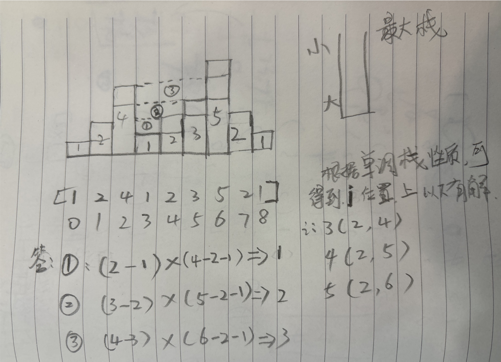
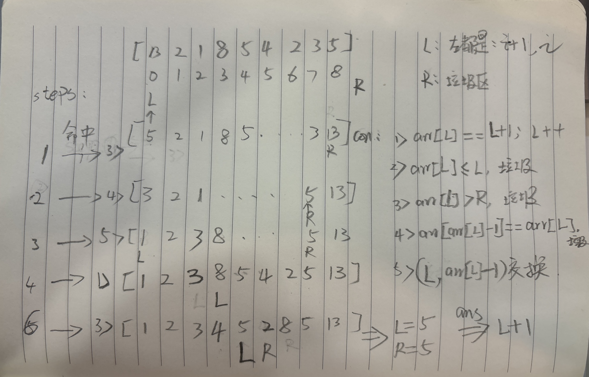

# 双指针技巧

设置两个指针的技巧，其实这种说法很宽泛，似乎 没什么可总结的

1. 有时候所谓的双指针技巧，就单纯是代码过程用双指针的形式表达出来而已。   没有单调性（贪心）方面的考虑
2. 有时候的双指针技巧包含**单调性（贪心）**方面的考虑，牵扯到可能性的取舍。   对分析能力的要求会变高。其实是**先有的思考和优化**，然后代码变成了 双指针的形式。
3. 所以，双指针这个“皮”不重要，**分析题目单调性（贪心）方面的特征**，这个能力才重要。

常见的双指针类型：

1）同向双指针

2）快慢双指针

3）从两头往中间的双指针

4）其他

## 题目1: 按奇偶排序数组II

> https://leetcode.cn/problems/sort-array-by-parity-ii/

给定一个非负整数数组 `nums`， `nums` 中一半整数是 **奇数** ，一半整数是 **偶数** 。

对数组进行排序，以便当 `nums[i]` 为奇数时，`i` 也是 **奇数** ；当 `nums[i]` 为偶数时， `i` 也是 **偶数** 。

你可以返回 *任何满足上述条件的数组作为答案* 。

**思路：**

1. 准备两个指针，分别代表偶数位和奇数位
2. 只看最后一个位置，如果是**奇数**，那么和**当前奇数位**上的值进行交换，然后奇数位+2 
3. 如果最后一个位置是**偶数**，那么和当前偶数位上的值进行交换，然后偶数+2

```java
public static int[] sortArrayByParityII(int[] nums) {
    int N = nums.length;
    for (int even = 0, odd = 1; odd < N && even < N; ) {
        if ((nums[N - 1] & 1) == 1) { // odd
            swap(nums, odd, N - 1);
            odd += 2;
        } else { //even
            swap(nums, even, N - 1);
            even += 2;
        }
    }
    return nums;
}

private static void swap(int[] arr, int i, int j) {
    int tmp = arr[i];
    arr[i] = arr[j];
    arr[j] = tmp;
}
```

## 题目2: [寻找重复数](https://leetcode.cn/problems/find-the-duplicate-number/)

> https://leetcode.cn/problems/find-the-duplicate-number/

给定一个包含 `n + 1` 个整数的数组 `nums` ，其数字都在 `[1, n]` 范围内（包括 `1` 和 `n`），可知至少存在一个重复的整数。

假设 `nums` 只有 **一个重复的整数** ，返回 **这个重复的数** 。

你设计的解决方案必须 **不修改** 数组 `nums` 且只用常量级 `O(1)` 的额外空间。

**思路：**

1. 基于快慢指针的方式进行查找
2. 从0位置开始，如果0位数据为2，那么就去2位置，依次类推
3. 如果出现重复数据，那么这查询一定会组成一个环，这个重复的数据一定就是当前的环的入口节点
4. 那么就可以考虑使用链表中技巧，基于快慢指针方式。
5. 当快慢指针相遇，那么将快指针从0开始，此时快慢指针同时移动，一旦相遇就是这个入口节点，也就是重复的数

```java
public static int findDuplicate(int[] nums) {
    if (nums == null || nums.length < 2) return -1;
    int slow = nums[0];
    int fast = nums[nums[0]];
    while (slow != fast) {
        slow = nums[slow];
        fast = nums[nums[fast]];
    }
    fast = 0;
    while (slow != fast) {
        slow = nums[slow];
        fast = nums[fast];
    }
    return slow;
}
```

## 题目3: 接雨水

接雨水：

给定 n 个非负整数表示每个宽度为 1 的柱子的高度图，计算按此排列的柱子，下雨之后能接多少雨水

测试链接 : https://leetcode.cn/problems/trapping-rain-water/

注意：二维接雨水问题，会在宽度优先遍历的章节讲述，后续的【必备】课程

**单调栈思路**：

1. 根据单调栈特性，这道题显然是求左边和右边比他大，且离它最近的位置在哪
2. 根据这个性质，可以求得每个位置上的，左右比他大的位置
3. 当 **i** 位置上的数**大于栈顶** 的数时，此时才可能组成**有效解**
4. 弹出当前元素作为当前的bottom
5. Left 左：栈顶弹出之后的下一个元素， 右：当前 i 位置
6. with：i - left - 1
7. height：min(arr[i],are[left]) - arr[bottom]
8. Ans += with * height;



```java
public int trap(int[] height) {
    Stack<Integer> stack = new Stack<>();
    int ans = 0;
    for (int i = 0; i < height.length; i++) {
        // 当前柱子高于栈顶柱子时，需要计算雨水
        while (!stack.isEmpty() && height[i] > height[stack.peek()]) {
            int bottom = stack.pop();
            if (stack.isEmpty()) break;
            int left = stack.peek();
            int waterHeight = Math.min(height[left], height[i]) - height[bottom];
            int with = i - left - 1;
            ans += with * waterHeight;
        }
        stack.push(i);
    }
    return ans;
}
```

**双指针思路**：

> 当来到i位置，求该位置所能接的最大雨水。也就是当来到i位置的时候，**它往上最高能到多高**，取决于左右的限制
>
> 前提：需要知道**0～i-1位置的最大值**，需要知道**i+1 ～ n-1的最大值**。
>
> 这两个值小的那个就是i位置所能接雨水的限制。
>
> 那么此时：雨水 = min（Lmax(i-1), Rmax(i+1)） - height(i) 
>
> 因为当前i的高度可能特别高，它不能接任何雨水，导致上面的值为负数，因此需要和0进行PK
>
> 所以：最总i位置的雨水 = max( 0 , min(Lmax(i-1), Rmax(i+1)) - height(i) )

```java
public int trap1(int[] height) {
    int[] leftMax = new int[height.length];
    leftMax[0] = height[0];
    int[] rightMax = new int[height.length];
    rightMax[height.length - 1] = height[height.length - 1];
    // 从左侧开始，每个位置上0～i最大值
    for (int i = 1; i < height.length; i++) {
        leftMax[i] = Math.max(height[i], leftMax[i - 1]);
    }
    // 从右侧开始，每个位置，i～n-1最大值
    for (int i = height.length - 2; i >= 0; i--) {
        rightMax[i] = Math.max(height[i], rightMax[i + 1]);
    }

    int ans = 0;
    // 第一个位置 ，和最后一个位置雨水必为0
    for (int i = 1; i < height.length - 1; i++) {
        ans += Math.max(0, Math.min(leftMax[i - 1], rightMax[i + 1]) - height[i]);
    }
    return ans;
}
```

**双指针优化：**

也是基于上面的思路进行的优化。

左指针L， 从左往右，右指针R，从右往左。

左侧最大值，**Lmax**， 右侧最大值：**Rmax**

那么：当L来到如下位置，

1. 比较左右两侧，如果LMAX小于等于Rmax，那么可以根据上面公式得到L位置的雨水，
2. 尝试更新Lmax的值，
3. L++

右边同理。

记住：哪边小，就可以计算出那边位置上的雨水量。因为假设 0～i 位置LMAX，一定能跟RMAX组成的一个方框构成一个可以装容器部分


代码：

```java
public int trap2(int[] height) {
    int leftMax = height[0];
    int rightMax = height[height.length - 1];
    int left = 1, right = height.length - 2;
    int ans = 0;
    while (left <= right) {
        if (leftMax <= rightMax) {
            ans += Math.max(leftMax - height[left], 0);
            leftMax = Math.max(leftMax, height[left++]); // 更新leftMax并且left++
        } else {
            ans += Math.max(rightMax - height[right], 0);
            rightMax = Math.max(rightMax, height[right--]);
        }
    }
    return ans;
}
```


## 题目4: 救生艇

> https://leetcode.cn/problems/boats-to-save-people/

给定数组 people

people[i]表示第 i 个人的体重 ，船的数量不限

每艘船可以承载的最大重量为 limit

每艘船最多可同时载两人，但条件是这些人的重量之和最多为 limit

返回 承载所有人所需的最小船数

**思路：**

1. 先将数组从小到大排好序
2. 然后准备两个指针，left 和 right 指针，分别从数组的左和右依次向数组中间靠拢
3. 如果 left + right 的重量超过了 limit 那么只取 right的，right--, 因为当前数组中 **最小**和**最大**的重量 不能组成一个
4. 如果 left + right 的重量没有超过，那么分别取左和右的组成一个，因此：left++，right--

```java
// 时间复杂度O(n * logn)，因为有排序，额外空间复杂度O(1)
public static int numRescueBoats(int[] people, int limit) {
    Arrays.sort(people);
    int l = 0, r = people.length - 1;
    int ans = 0;
    while (l <= r) {
        int sum = l == r ? people[l] : people[l] + people[r];
        if (sum <= limit) l++;
        r--;
        ans++;
    }
    return ans;
}
```

**扩展：**

再增加一个要求，如果两人一船那么体重之和必须是偶数，又该怎么做？（大厂真考过）

**思路：**也就是说，只能是奇数+奇数，或者偶数+偶数。

因此：只需要**将数组分成两个奇数的数组和偶数的数组**，然后分别计算，最后将总和相加即可。

## 题目5: 盛最多水的容器

> https://leetcode.cn/problems/container-with-most-water/

给定一个长度为 n 的整数数组 height

有 n 条垂线，第 i 条线的两个端点是 (i, 0) 和 (i, height[i])

找出其中的两条线，使得它们与 x 轴共同构成的容器可以容纳最多的水

返回容器可以储存的最大水量

说明：你不能倾斜容器

**思路：**

1. 准备两个指针，left 和 right
2. 分别从0位置，以及 n-1 位置开始移动
3. 当前来到left和righ位置，计算其可以组成的最大容量，
4. 如果 left 位置 比 right 位置 更高，那么移动右侧位置，看这个更高的是否能组成更大的容量
5. 否则就移动 left 位置，依次计算最大位置

```java
// 时间复杂度O(n)，额外空间复杂度O(1)
public static int maxArea(int[] height) {
    int ans = 0, n = height.length;
    for (int l = 0, r = n - 1; l < r; ) { // l != r 否则容量为0
        ans = Math.max(ans, Math.min(height[l], height[r]) * (r - l));
        if (height[l] <= height[r]) l++;
        else r--;
    }
    return ans;
}
```

## 题目6：供暖器

冬季已经来临。 你的任务是设计一个有固定加热半径的供暖器向所有房屋供暖。

在加热器的加热半径范围内的每个房屋都可以获得供暖。

现在，给出位于一条水平线上的房屋 houses 和供暖器 heaters 的位置

请你找出并返回可以覆盖所有房屋的最小加热半径。

说明：所有供暖器都遵循你的半径标准，加热的半径也一样。

> https://leetcode.cn/problems/heaters/

**思路：**

1. 分别将 houses 和 headters 排好序
2. 准备两个指针 i ，j 分别代表当前 来到第 i 个房间和 第 j 个加热器
3. 当来到 i 位置时，此时的 j 代表供暖是最优的吗？
4. a 为 houses[i]由heaters[j]供暖产生的半径，b 为 houses[i]由heaters[j+1]供暖产生的半径
5. 如果 a  < b , 说明是最优，否则就不是，应该跳到下一个位置

```java
public static int findRadius(int[] houses, int[] heaters) {
    Arrays.sort(heaters);
    Arrays.sort(houses);
    int ans = 0;
    for (int i = 0, j = 0; i < houses.length; i++) {
        // 当前如果不是最优的，那么j++ 跳向下一个位置
        while (!best(houses, heaters, i, j)) {
            j++;
        }
        ans = Math.max(ans, Math.abs(houses[i] - heaters[j]));
    }
    return ans;
}

// 当前来到地点：housese【i】由heaters【j】供暖为：a
// 当前来到地点：housese【i】由heaters【j+1】供暖为：b
// 当 a <  b时，此时为最优解否则不是，j++
private static boolean best(int[] houses, int[] heaters, int i, int j) {
    return j == heaters.length - 1  // 如果j来到了最后一个位置，说明这就是最优解
            ||                      // 否则比较 a 和 b的值
            Math.abs(houses[i] - heaters[j]) < Math.abs(houses[i] - heaters[j + 1]);
}
```

##  题目7：缺失的第一个正数

给你一个未排序的整数数组 nums ，请你找出其中没有出现的最小的正整数。

请你实现时间复杂度为 O(n) 并且只使用常数级别额外空间的解决方案。

> https://leetcode.cn/problems/first-missing-positive/

玩概念了！

**思路：理解就不难**

1. 大思路是：从0开始，将对应位置应该放置的数，依次从下标0，1，2，3.放置好，最小正整数一定是从1开始，而我们从下标0开始
2. 定义：准备两个指针，分别从左，和右开始，那么左就是需要填好的位置，
3. 右代表的从1～R位置我都能做到排好序的情况，r～N数组长度位置，则代表的是垃圾数据，直接不管。
4. **情况1**：arr[L] = L + 1，此时L位置数据正确放置了，L++
5. **情况2**：arr[L] <= L，垃圾，跟R位置替换，R--
6. **情况3**：arr[L]  >  R，垃圾，跟R位置替换，R--
7. **情况4**：arr[arr[L] - 1] = arr[L]，垃圾，跟R位置替换，R-- 
8. **情况5**：交换，跟 arr[L] - 1 位置的数据交换



```java
// 时间复杂度O(n)，额外空间复杂度O(1)
public static int firstMissingPositive(int[] arr) {
    int L = 0, R = arr.length;
    while (L < R) {
        if (arr[L] == L + 1) L++;
        else if (arr[L] <= L || arr[L] > R || arr[arr[L] - 1] == arr[L]) swap(arr, L, --R);
        else swap(arr, L, arr[L] - 1);
    }
    return L + 1;
}

private static void swap(int[] arr, int l, int r) {
    int tmp = arr[l];
    arr[l] = arr[r];
    arr[r] = tmp;
}
```