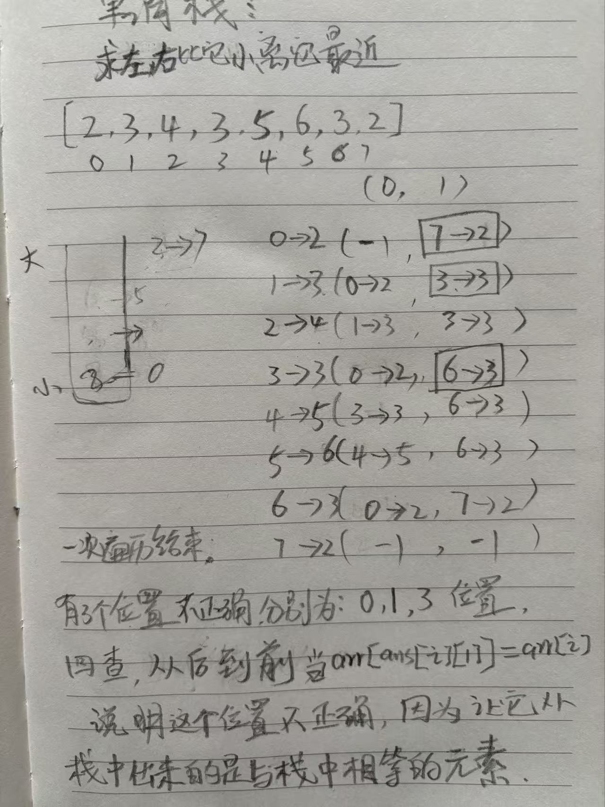

# 单调栈 - Monotonic stack

一种特别设计的栈结构，为了解决如下的问题：

用来快速查找每个元素作为子数组最小值或者最大值时的左右边界。

给定一个可能含有重复值的数组arr，i位置的数一定存在如下两个信息

1. arr[i]的左侧离i最近并且小于(或者大于)arr[i]的数在哪？
2. arr[i]的右侧离i最近并且小于(或者大于)arr[i]的数在哪？

如果想得到arr中所有位置的两个信息，怎么能让得到信息的过程尽量快。

那么到底怎么设计呢？

**注意：单调栈时间复杂度是O(N)，为什么， 因为每个位置只入栈一次**

## 单调栈最经典的用法是解决如下问题：

每个位置都求：

1. 当前位置的 **左侧**比当前位置的数字**小**，且**距离最近的位置** 在哪

2. 当前位置的 **右侧**比当前位置的数字**小**，且**距离最近的位置** 在哪

或者 同理每个位置都求：

1. 当前位置的 **左侧**比当前位置的数字**大**，**且距离最近的位置** 在哪

2. 当前位置的 **右侧**比当前位置的数字**大**，且**距离最近的位置** 在哪



## 题目一、单调栈最经典用法的模版

> 测试链接 : https://www.nowcoder.com/practice/2a2c00e7a88a498693568cef63a4b7bb

```java
package problems.nowcoder;

import java.io.*;

public class MonotonicStack {

    public static int MAXN = 1000001;
    public static int[] arr = new int[MAXN];
    public static int[] stack = new int[MAXN];
    public static int[][] ans = new int[MAXN][2];
    public static int n, r;

    public static void main(String[] args) throws IOException {
        BufferedReader br = new BufferedReader(new InputStreamReader(System.in));
        StreamTokenizer in = new StreamTokenizer(br);
        PrintWriter out = new PrintWriter(new OutputStreamWriter(System.out));
        while (in.nextToken() != StreamTokenizer.TT_EOF) {
            n = (int) in.nval;
            for (int i = 0; i < n; i++) {
                in.nextToken();
                arr[i] = (int) in.nval;
            }
            compute();
            for (int i = 0; i < n; i++) {
                out.println(ans[i][0] + " " + ans[i][1]);
            }
        }
        out.flush();
        out.close();
        br.close();
    }

    private static void compute() {
        int r = 0;
        int cur;
        for (int i = 0; i < n; i++) {
            while (r > 0 && arr[stack[r - 1]] >= arr[i]) {
                cur = stack[--r];
                //
                ans[cur][0] = r > 0 ? stack[r - 1] : -1;
                ans[cur][1] = i;
            }
            stack[r++] = i;
        }
        // 栈中仍然有数据
        while (r > 0) {
            cur = stack[--r];
            ans[cur][0] = r > 0 ? stack[r - 1] : -1;
            ans[cur][1] = -1;
        }
        // 如果存在相同的数据，那么需要更新这个数据
        // 跳过n-1位置，因为它一定是正确值
        // 只更新右侧的值，因为左侧一定是正确的
        for (int i = n - 2; i >= 0; i--) {
            if (ans[i][1] != -1 && arr[ans[i][1]] == arr[i]) {
                ans[i][1] = ans[ans[i][1]][1];
            }
        }
    }
}
```

## 题目二、每日温度

给定一个整数数组 temperatures ，表示每天的温度，返回一个数组 answer

其中 answer[i] 是指对于第 i 天，下一个更高温度出现在几天后

如果气温在这之后都不会升高，请在该位置用 0 来代替。

> https://leetcode.cn/problems/daily-temperatures/description/

**每日温度其实就是：找左边，比他大，且离它最近的位置。**

```java
		// 输入: temperatures = [73,74,75,71,69,72,76,73]
    // 输出: [1,1,4,2,1,1,0,0]
    public int[] dailyTemperatures(int[] temperatures) {
        int[] ans = new int[temperatures.length];
        Stack<Integer> stack = new Stack<>();
        for (int i = 0; i < temperatures.length; i++) {
            while (!stack.isEmpty() && temperatures[stack.peek()] < temperatures[i]) {
                int idx = stack.pop();
                ans[idx] = i - idx;
            }
            stack.push(i);
        }
        return ans;
    }
```

## 题目三、子数组的最小值之和

子数组的最小值之和

给定一个整数数组 arr，找到 min(b) 的总和，其中 b 的范围为 arr 的每个（连续）子数组。

由于答案可能很大，因此 返回答案模 10^9 + 7

>  https://leetcode.cn/problems/sum-of-subarray-minimums/

**思路：以某个位置 i 为 最小值的子数组的情况下，求他所对应的所有结果**。

核心：**(cur - left) * ( i - cur) * arr[i]** 


```java
package algo.zuo.code_52;

/**
 * 子数组的最小值之和
 * 给定一个整数数组 arr，找到 min(b) 的总和，其中 b 的范围为 arr 的每个（连续）子数组。
 * 由于答案可能很大，因此 返回答案模 10^9 + 7
 * 测试链接 : https://leetcode.cn/problems/sum-of-subarray-minimums/
 *
 */
public class Code03_SubMinSum {
    int MAX = 30001;
    int mod = 1000000007;
    int[] stack = new int[MAX];
    int r;

    public int sumSubarrayMins(int[] arr) {
        r = 0;
        long ans = 0;
        for (int i = 0; i < arr.length; i++) {
            while (r > 0 && arr[stack[r - 1]] >= arr[i]) {
                int cur = stack[--r];
                int left = r == 0 ? -1 : stack[r - 1];
                ans = (ans + (long) (cur - left) * (i - cur) * arr[cur]) % mod;
            }
            stack[r++] = i;
        }
        while (r > 0) {
            int cur = stack[--r];
            int left = r == 0 ? -1 : stack[r - 1];
            ans = (ans + (long) (cur - left) * (arr.length - cur) * arr[cur]) % mod;
        }
        return (int) ans;
    }
}
```
